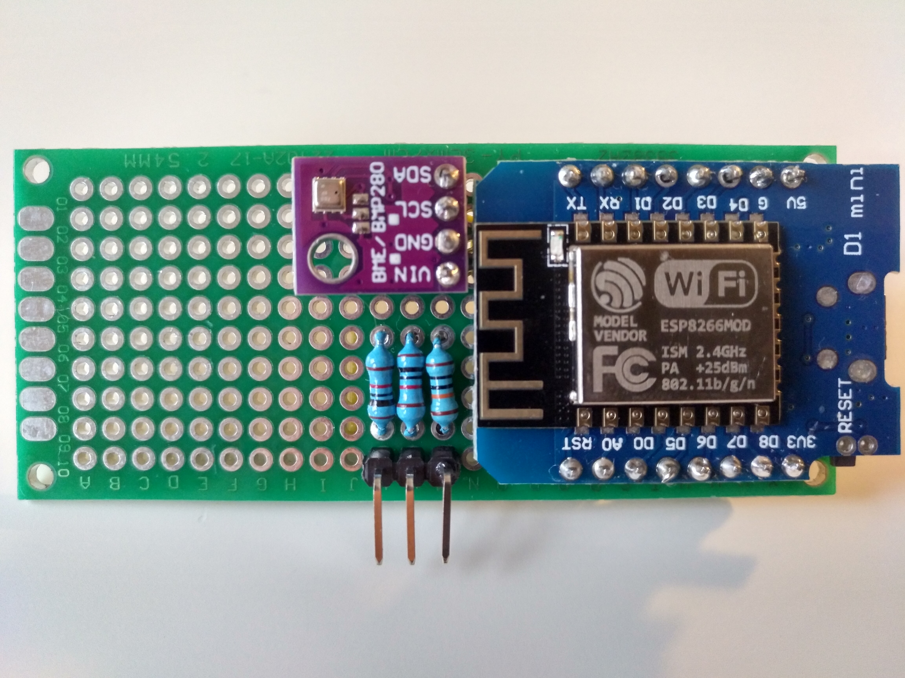
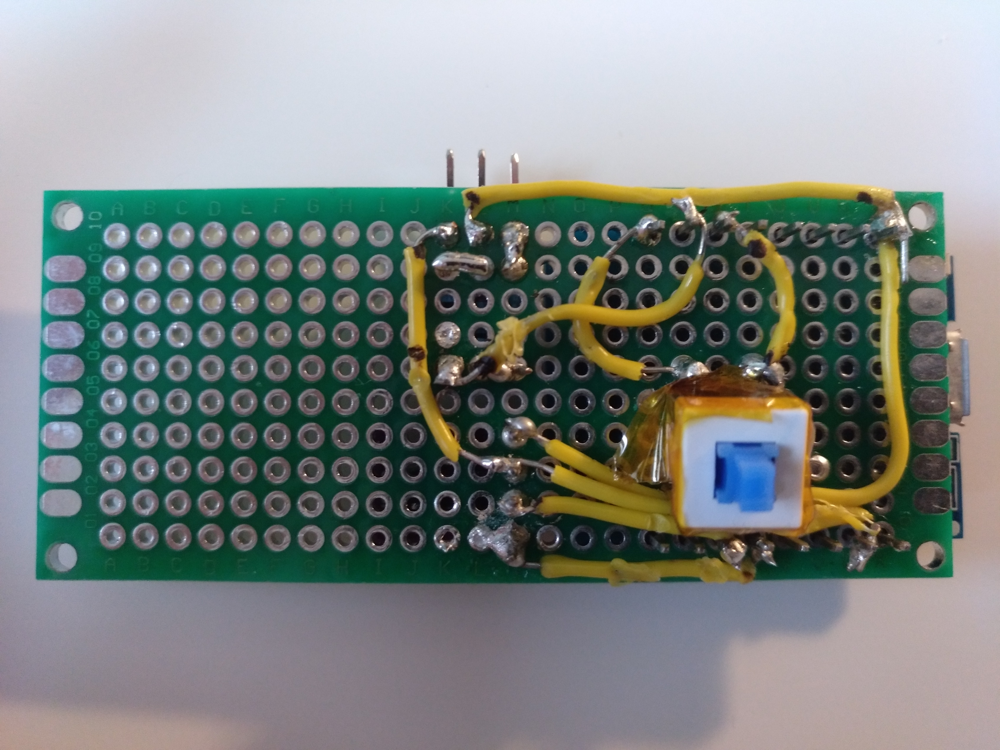
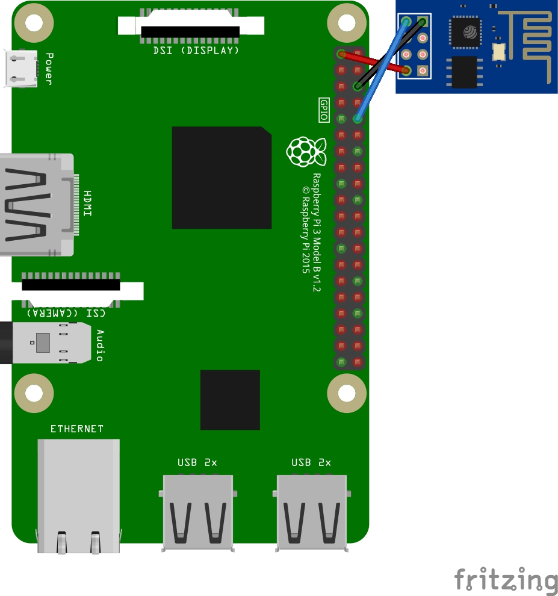

# ESPi Weather Station

A small weather station built with 2 ESP8266 and a Rasberry Pi server.

## Get the parts
- Raspberry Pi 3 B ([raspberrypi.org](https://www.raspberrypi.org/products/raspberry-pi-3-model-b/))
  - SD card
  - Power adapter
  - Case
- ESP8266 01 ([Amazon.de](https://www.amazon.de/dp/B074RLG5TC))
  - ESP 01 Programmer ([Amazon.de](https://www.amazon.de/TS-Trade-ESP8266-Seriell-Adapter/dp/B077Z4L8DD))
- Wemos D1 mini / ESP8266 12F ([Amazon.de](https://www.amazon.de/dp/B0754N794H))
- BME280 temperature, humidity & pressure sensor ([Amazon.de](https://www.amazon.de/dp/B07FS95JXT))
- Wemos 18650 battery shield V3/3.1 ([Amazon.de](https://www.amazon.de/dp/B07M78S1M8))
- Switch
- 120k Resistor

## Assemble the Weather Station
Use the [station schematic](./schematics/station.pdf) to assemble the Weather station. Here is how it could look like:

## Assemble the server / receiver
Connect the ESP 01 to the Raspberry Pi: 

## Setup the server